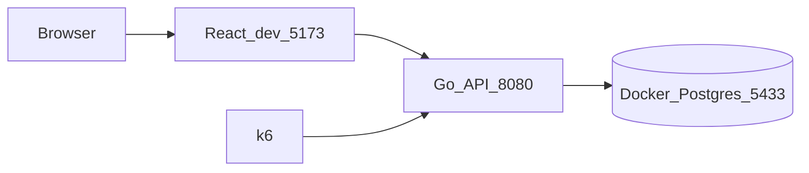
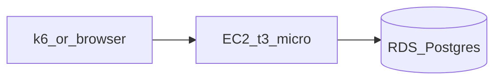
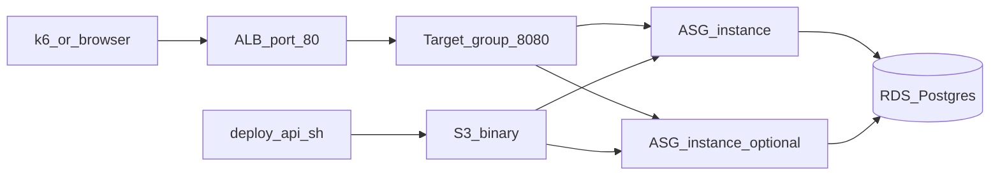
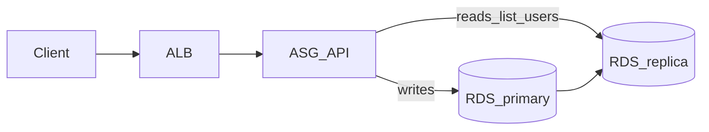

# Phase analysis — Scale Zero to 1 Million

This document explains **what we built in each scaling phase**, **why** (mapped to the [ByteByteGo “Scale from zero to millions”](https://bytebytego.com/courses/system-design-interview/scale-from-zero-to-millions-of-users) journey), and **load-test results** where we ran them.

**Stack:** Go API · React (Vite) UI · PostgreSQL · AWS `ap-south-1` · Terraform (`main.tf`) · [k6](https://k6.io/) load tests.

**Repo layout:** [`backend/`](../backend/) · [`frontend/`](../frontend/) · [`loadtests/k6/`](../loadtests/k6/) · [`docs/cost-estimation.md`](cost-estimation.md)

---

## Summary table

| Phase | Status | Theme (ByteByteGo) | Load test recorded? |
|-------|--------|--------------------|---------------------|
| 0 | Done | Single server (laptop) | Yes — local |
| 1 | Done (replaced by Phase 2) | Web tier + DB tier on AWS | Health only; k6 not archived before migration |
| 2 | Done | Load balancer + horizontal web tier | Yes — via ALB |
| 3 | Done | DB read replication | Yes — via ALB |
| 4 | Done | Cache (Redis) | Yes — via ALB |
| 5 | Done | CDN (static frontend) | Yes — via CloudFront `/api` |
| 6 | Done | Metrics & guardrails | Yes — `mixed.js` soak (ALB) |
| 7 | Done | ~1M rows + keyset pagination | Yes — `list-users-deep.js` (50k + 1M) |
| 8 | Done | Wrap-up, future design, teardown | Cross-phase metrics table |

---

## Phase 0 — Local foundation

### What we did

- **Backend:** Go (Gin) API — `POST /api/v1/signup`, `GET /api/v1/users` (admin), `/health`, `/ready`.
- **Frontend:** React signup + paginated admin (`http://localhost:5173`).
- **Database:** PostgreSQL in Docker (`docker-compose.yml`, host port **5433**).
- **Load tests:** k6 scripts under `loadtests/k6/`.

### Why

- Prove the product and APIs **before paying for AWS**.
- Establish a **baseline** for latency and throughput on one process + local Postgres.
- Same APIs and k6 scripts are reused in later phases for apples-to-apples comparison.

### Architecture



### Load test results (local Mac)

Environment: `BASE_URL=http://localhost:8080`, Docker Postgres, single `go run` process.

| Script | VUs | Duration | ~RPS | p95 (ms) | Error % | Notes |
|--------|-----|----------|------|----------|---------|-------|
| `signup.js` | 10 | 30s | **~61** | **~71** | 0% | Comfortable baseline |
| `list-users.js` | 10 | 30s | **~83** | **~78** | 0% | Reads faster than writes |
| `stress-signup.js` | ramp → 100 | 85s | **~106** (peak) | **~783** | 0% | Latency rises under load |
| `signup.js` | 150 | 45s | **~119** | **~1530** | 0% | Throughput flat; latency high |
| `signup.js` | 250 | 30s | **~117** | **~2600** | 0% | CPU/DB/bcrypt bound |

**Takeaway:** ~**115–120 signups/sec** with 0% errors locally, but p95 degrades above ~100 VUs. Bottleneck: **bcrypt + single DB writer + one API process**.

```bash
k6 run loadtests/k6/signup.js
```

---

## Phase 1 — AWS single server (EC2 + RDS)

### What we did

- **Terraform `scaling_phase = 1`:** one **EC2 `t3.micro`** (Go API) + **RDS PostgreSQL `db.t3.micro`** (20 GB), **no ALB**.
- Deploy: `./scripts/deploy-api.sh` (SSH + binary to EC2).
- **Region:** `ap-south-1`.
- Example API URL (historical Phase 1): `http://<ec2-public-ip>:8080` (removed when Phase 2 applied).

### Why

- **Separate web and database tiers** (ByteByteGo) — app on EC2, data on RDS.
- **Cheapest AWS start:** no ALB hourly charge; good for first cloud baseline.
- **Stateless API design** (admin key / JWT-ready) prepares for later horizontal scale.

### Architecture (historical)



### Load test results

| Script | Result |
|--------|--------|
| Manual | `/health` and `/ready` OK on public IP after deploy |
| k6 (archived) | **Not captured** before Phase 2 replaced the single EC2 |

**Takeaway:** Phase 1 validated **deploy path + RDS connectivity**. Formal k6 vs Phase 0 was planned but infra was upgraded to Phase 2 before we stored AWS Phase 1 numbers. For a fair cloud write baseline, compare Phase 0 local to **Phase 2 ALB** (below) — both are “production-shaped” HTTP paths.

---

## Phase 2 — Application Load Balancer + Auto Scaling

### What we did

- **`scaling_phase = 2`** in `terraform.tfvars`: **ALB** (HTTP :80) → **target group** (:8080) → **ASG** (`asg_min_size=1`, `asg_max_size=2`).
- **S3** artifact bucket for API binary; deploy via `./scripts/deploy-api.sh` → `deploy-api-phase2.py` (S3 upload + instance refresh).
- Phase 1 standalone EC2 **destroyed**; API only through ALB (instances without direct public API SG rule from internet).
- **API URL:** `http://scale-zero-to-million-alb-277154478.ap-south-1.elb.amazonaws.com`

### Why

- **Load balancer:** stable DNS, health checks, spread traffic across instances (ByteByteGo).
- **Horizontal scale:** add a second `t3.micro` under load without changing clients.
- **Failover practice:** unhealthy instance drained; ALB routes to healthy targets.
- **Stateless web tier:** any instance can serve any request (no sticky sessions).

### Architecture



### Load test results (AWS via ALB)

Environment: `BASE_URL=http://scale-zero-to-million-alb-277154478.ap-south-1.elb.amazonaws.com`  
Admin list tests: `ADMIN_API_KEY` must match `admin_api_key` in your local `terraform.tfvars` (not committed).

| Script | VUs | Duration | ~RPS | p95 (ms) | Error % | Notes |
|--------|-----|----------|------|----------|---------|-------|
| `signup.js` | 10 | 30s | **~22** | **~472** | 0% | Network + RDS + single instance in ASG |
| `list-users.js` | 10 | 30s | **~69** | **~183** | 0% | With correct `ADMIN_API_KEY` |

**Comparison to Phase 0 (signup, 10 VUs):** Local **~61 RPS / ~71 ms p95** vs AWS **~22 RPS / ~472 ms p95** — expected: internet RTT, TLS path, RDS over VPC, smaller effective CPU on `t3.micro`, bcrypt cost unchanged.

```bash
export BASE_URL=http://scale-zero-to-million-alb-277154478.ap-south-1.elb.amazonaws.com
export ADMIN_API_KEY=<your-admin-key-from-terraform>
k6 run loadtests/k6/signup.js
k6 run loadtests/k6/list-users.js
```

### Exit criteria (Phase 2)

- [x] `curl $BASE_URL/health` → 200
- [x] `curl $BASE_URL/ready` → 200
- [x] k6 signup + list-users with admin key
- [ ] Scale ASG to 2 instances and repeat k6 (optional — document if you run it)

---

## Phase 3 — RDS read replica

### What we did (code + Terraform)

- **`scaling_phase = 3`** in `terraform.tfvars`: `aws_db_instance.replica` from primary; SSM `database_replica_url` for EC2.
- **Go:** `store.Connect(primary, replica)` — `CreateUser` on **write** pool, `ListUsers` on **read** pool; migrations only on primary.
- **Config:** `DATABASE_REPLICA_URL` (from SSM via `scripts/ec2-user-data.sh` / `refresh-env.sh`).

### Why

- **Read/write split** — admin list is read-heavy; offloads primary (ByteByteGo replication chapter).
- Prepare for higher read QPS without scaling app tier alone.

### Architecture



### Load test results (AWS, same ALB)

Environment: `BASE_URL=http://scale-zero-to-million-alb-277154478.ap-south-1.elb.amazonaws.com`, 10 VUs, 30s, after deploy + `/ready` OK.

| Script | VUs | Duration | ~RPS | p95 (ms) | Error % | Notes |
|--------|-----|----------|------|----------|---------|-------|
| `list-users.js` | 10 | 30s | **~29** | **~394** | 0% | Reads hit **replica** |
| `signup.js` | 10 | 30s | **~22** | **~485** | 0% | Writes still on **primary** |
| `mixed.js` | 15 | 1m | **~33** (all HTTP) | **~716** | 0% | ~70% signup, ~20% list, ~10% health |

**Takeaway:** Signup throughput/latency matches Phase 2 (writes unchanged). List-users **RPS is lower** than Phase 2 (~69 → ~29) with **higher p95** — expected tradeoffs at this scale: second `db.t3.micro`, more rows in DB, and `COUNT(*)` + page query still run on Postgres (replica does not remove query cost). The win is **isolating read load from the primary** under mixed traffic (see Phase 4 cache for p95 on hot lists).

**Phase 2 reference (before replica):** list-users ~**69** RPS / p95 ~**183** ms; signup ~**22** RPS / p95 ~**472** ms.

### Exit criteria (Phase 3)

- [x] Replica in Terraform / `rds_replica_address` output
- [x] `/ready` OK (primary + replica ping)
- [x] k6 signup + list-users recorded
- [x] `mixed.js` (15 VUs, 1m) — 1991 checks, 0% errors
- [ ] Optional: RDS **ReplicaLag** during soak

---

## Phase 4 — ElastiCache Redis

### What we did (code + Terraform)

- **`scaling_phase = 4`** in `terraform.tfvars`: **ElastiCache** `cache.t3.micro` (Redis 7.1), SG allows **6379** from API instances, SSM `redis_url`.
- **Go:** optional `REDIS_URL` — `ListUsers` caches JSON per `users:list:v{ver}:page:{p}:limit:{l}` (**60s TTL**); **signup** `INCR users:list:ver` to invalidate list caches.

### Why

- Reduce repeated identical **list** queries hitting Postgres/replica (ByteByteGo cache tier).
- Improve p95 for hot pages (e.g. admin `page=1&limit=20`).

### Load test results (AWS)

| Script | VUs | Duration | ~RPS | p95 (ms) | Error % | Notes |
|--------|-----|----------|------|----------|---------|-------|
| `list-users.js` | 10 | 30s | **~72** | **~58** | 0% | Cache warm (`page=1&limit=20`) |
| `list-users.js` (retry) | 10 | 30s | ~52 | ~81 | **84%** | **Invalid** — k6 started during ASG refresh (502s) |

**Takeaway:** With Redis, list throughput and p95 improved sharply vs Phase 3 (~**29** RPS, p95 ~**394** ms) for the hot admin page. Re-run k6 only after `deploy-api.sh` finishes waiting for healthy targets (script updated).

### Exit criteria (Phase 4)

- [x] ElastiCache + `redis_endpoint` / SSM `redis_url`
- [x] `/ready` OK (DB + Redis)
- [x] k6 `list-users.js` recorded (post-refresh)

See `loadtests/k6/results-aws.log`.

---

## Phase 5 — CDN for frontend

### What we did (code + Terraform)

- **`scaling_phase = 5`:** S3 static bucket + **CloudFront** (HTTPS).
- **Same distribution:** default → S3 (React SPA); `/api/*` → **ALB** (no mixed-content: UI and API both HTTPS on CloudFront domain).
- **`VITE_API_BASE_URL`** = CloudFront URL at build time (`./scripts/deploy-frontend.sh`).
- API **CORS** includes `https://<cloudfront-domain>`; run **`./scripts/deploy-api.sh`** after apply so instances pick up CORS.

### Why

- **CDN** for static assets (ByteByteGo); edge-cached JS/CSS; single HTTPS origin for browser.

### Live URLs (2026-09-23)

| Resource | URL |
|----------|-----|
| **Frontend (CloudFront)** | `https://dbczpee0qtbbv.cloudfront.net` |
| Signup | `https://dbczpee0qtbbv.cloudfront.net/` |
| Admin | `https://dbczpee0qtbbv.cloudfront.net/admin` |
| Direct ALB (k6 / debug) | `http://scale-zero-to-million-alb-277154478.ap-south-1.elb.amazonaws.com` |

Smoke: SPA **200**, `GET /api/v1/users` **200**, `POST /api/v1/signup` **201**.

### Load test (via CloudFront)

| Script | VUs | Duration | ~RPS | p95 (ms) | Error % |
|--------|-----|----------|------|----------|---------|
| `list-users.js` | 10 | 30s | **~75** | **~37** | 0% |

(`BASE_URL=https://dbczpee0qtbbv.cloudfront.net` — same ballpark as ALB + Redis cache.)

### Exit criteria (Phase 5)

- [x] CloudFront + S3; `frontend_url` output
- [x] `./scripts/deploy-frontend.sh` completes
- [x] API through CloudFront `/api/*` verified

---

## Phase 6 — Observability

### What we did (Terraform)

- **`scaling_phase = 6`:** CloudWatch dashboard **`${project_name}-ops`** — ALB p95 & 5xx, ASG in-service count, RDS primary CPU/connections, Redis CPU, **replica lag**.
- **Alarms** (no SNS in lab — view in console): ALB target 5xx, RDS CPU > 80%, replica lag > 60s.
- Outputs: `cloudwatch_dashboard_url`, `cloudwatch_dashboard_name`.

### Why

- **Logging, metrics, automation** (ByteByteGo) — see what breaks first during soak tests.

### Load tests (planned)

| Script | Goal |
|--------|------|
| `mixed.js` | 5–15 min soak; watch dashboard while k6 runs |

### Load test results (soak, ALB)

Environment: `BASE_URL` = `alb_api_url`, 15 VUs, 1m (`mixed.js`) — run while CloudWatch dashboard **`scale-zero-to-million-ops`** open.

| Script | VUs | Duration | ~RPS | p95 (ms) | Error % | Notes |
|--------|-----|----------|------|----------|---------|-------|
| `mixed.js` | 15 | 1m | **~33** | **~725** | 0% | 2011 checks; ~70% signup / ~20% list / ~10% health |

**Takeaway:** Mixed workload stayed **0% errors** at ~33 req/s; p95 ~725 ms reflects signup-heavy mix (bcrypt + writes), not list-only cache path. Use dashboard to correlate ALB p95, RDS connections, Redis CPU, and replica lag during longer soaks.

### Exit criteria (Phase 6)

- [x] `terraform apply` with `scaling_phase = 6`
- [x] `mixed.js` soak recorded (dashboard exercise)
- [ ] Optional: note CloudWatch alarm state (OK vs ALARM) during load

---

## Phase 7 — One million user rows (data scale)

### What we did

- **`scaling_phase = 7`** — same infra as Phase 6; phase marker + app/data changes only.
- **Bulk seed:** `backend/cmd/seed` — PostgreSQL `COPY` in batches (default `-target 1000000`, `-batch 5000`); resumes from existing `COUNT(*)`.
- **Keyset list API:** `GET /api/v1/users?after_id=<id>&limit=20` uses `(created_at, id)` cursor (`idx_users_created_at_id`); response includes `next_after_id`. Offset `?page=N` still works but is slow on deep pages.
- **Seed on AWS:** `./scripts/seed-via-ec2.sh` (SSM on ASG instance; RDS is VPC-private). Local: `seed-1m-users.sh` only if `DATABASE_URL` is reachable.

### Why

- Prove **data scale** (~1M rows), not 1M concurrent users (ByteByteGo growth / sharding story).

### Load tests

| Script | Goal |
|--------|------|
| `list-users-deep.js` | Mix: random high `page`, `after_id=0`, random `after_id` |
| `signup.js` | Lower rate while DB is large (optional) |

**Seed + deploy (paste-safe):** `./scripts/phase7-lab.sh` — defaults `SEED_TARGET=50000`; add `RUN_K6=1` for k6.

```bash
aws login
SEED_TARGET=50000 RUN_K6=1 ./scripts/phase7-lab.sh
```

Manual steps (no trailing comments on command lines):

```bash
./scripts/terraform-aws.sh apply -auto-approve
export DATABASE_URL=$(aws ssm get-parameter --name /scale-zero-to-million/database_url --with-decryption --query Parameter.Value --output text)
SEED_TARGET=50000 ./scripts/seed-via-ec2.sh
./scripts/deploy-api.sh
export BASE_URL=$(./scripts/terraform-aws.sh output -raw alb_api_url)
export ADMIN_API_KEY=<from terraform.tfvars>
export MAX_PAGE=2500
k6 run loadtests/k6/list-users-deep.js
```

### Seed (2026-09-23)

- **Target:** 50k users (`SEED_TARGET=50000` via SSM on an ASG instance).
- **Resume:** 4,173 existing → +45,827 in ~0.5s (`COPY` batches).

### Load test results (ALB, ~50k rows)

| Script | VUs | Duration | ~RPS | p95 (ms) | Error % | Notes |
|--------|-----|----------|------|----------|---------|-------|
| `list-users-deep.js` | 10 | 30s | **~65** | **~87** | 0% | Mix: random `page` (≤2500), `after_id=0`, random `after_id`; max **~514 ms** (likely deep offset) vs med **~41 ms** |

**Takeaway (50k):** Blended list traffic stayed fast (p95 ~87 ms). Tail latency on random deep **offset** pages shows in `max` (~514 ms) vs med ~41 ms.

### Load test results (ALB, ~1M rows)

| Script | VUs | Duration | ~RPS | p95 (ms) | Error % | Notes |
|--------|-----|----------|------|----------|---------|-------|
| `list-users-deep.js` | 10 | 2m | **~18.5** | **~1280** | 0% | `MAX_PAGE=50000`; avg ~437 ms, med ~246 ms, max **~3.03 s** |

**Compare 50k → 1M (same script, mixed traffic):**

| Rows | Duration | ~RPS | p95 | med | max |
|------|----------|------|-----|-----|-----|
| ~50k | 30s | ~65 | ~87 ms | ~41 ms | ~514 ms |
| ~1M | 2m | ~18.5 | ~1.28 s | ~246 ms | ~3.03 s |

**Takeaway (1M):** ~⅓ of requests use offset `?page=` (each runs `COUNT(*)` on 1M rows + deep `OFFSET`); that dominates blended latency and throughput. Keyset `after_id` and cache hits stay on the fast path (see `min` ~30 ms). Production fix: admin UI on keyset only; avoid offset pagination at scale.

**Reproduce 1M k6:**

```bash
SEED_TARGET=1000000 ./scripts/seed-via-ec2.sh
export BASE_URL=$(./scripts/terraform-aws.sh output -raw alb_api_url)
export ADMIN_API_KEY="<your-admin-api-key>"
export MAX_PAGE=50000 MAX_AFTER_ID=1000000 DURATION=2m
k6 run loadtests/k6/list-users-deep.js
```

### Exit criteria (Phase 7)

- [x] `scaling_phase = 7` applied
- [x] Seed to **~1M** + **50k** lab runs
- [x] `./scripts/deploy-api.sh` with keyset handler
- [x] `list-users-deep.js` at 1M — clear slowdown vs 50k (offset + `COUNT(*)`)

---

## Phase 8 — Wrap-up

### What we did

- **`scaling_phase = 8`** — tag-only marker (same infra as Phase 7).
- **[`future-scaling.md`](future-scaling.md)** — multi-AZ, PgBouncer/RDS Proxy, sharding/partitioning (design only).
- **[`scripts/teardown.sh`](../scripts/teardown.sh)** — guarded `terraform destroy` (`DESTROY_CONFIRM=destroy`).
- README + this file linked for GitHub publish.

### Why

- Close the lab with a **0 → 7 narrative** and a safe **$0 ongoing** path after destroy.

### Cross-phase load-test snapshot (AWS, representative scripts)

| Phase | Script | ~RPS | p95 (ms) | Error % | Highlight |
|-------|--------|------|----------|---------|-----------|
| 0 | `signup.js` | ~115–120 | ~71 | 0% | Local single process |
| 2 | `signup.js` | ~22 | ~472 | 0% | ALB + `t3.micro` |
| 2 | `list-users.js` | ~69 | ~183 | 0% | Offset page 1 |
| 3 | `list-users.js` | ~29 | ~394 | 0% | Reads on replica |
| 4 | `list-users.js` | ~72–75 | ~37–58 | 0% | Redis list cache |
| 5 | `list-users.js` | ~75 | ~37 | 0% | Via CloudFront `/api` |
| 6 | `mixed.js` | ~33 | ~725 | 0% | Signup-heavy soak |
| 7 | `list-users-deep.js` @ 50k | ~65 | ~87 | 0% | Mixed offset/keyset |
| 7 | `list-users-deep.js` @ 1M | ~18.5 | ~1280 | 0% | Offset + `COUNT(*)` at scale |

Full detail per phase in sections above; raw log: [`loadtests/k6/results-aws.log`](../loadtests/k6/results-aws.log).

### Teardown (stop AWS charges)

```bash
aws login
cd scale-zero-to-1-million
./scripts/terraform-aws.sh apply -auto-approve
DESTROY_CONFIRM=destroy ./scripts/teardown.sh
```

(`apply` optional — only updates Phase 8 tags; skip if you are tearing down immediately.) **Do not** commit `terraform.tfvars` or `.pem` keys.

**Cost after destroy:** ~**$0**/month for this stack — see [`cost-estimation.md`](cost-estimation.md).

### Exit criteria (Phase 8)

- [x] Future scaling notes documented
- [x] Cross-phase metrics table
- [x] Teardown script + runbook
- [ ] User runs `teardown.sh` when lab is finished (your choice)

---

## How to reproduce load tests

```bash
# Local Phase 0
docker compose up -d
cd backend && go run ./cmd/api
k6 run loadtests/k6/signup.js

# AWS (Phase 2+)
export BASE_URL=$(cd .. && ./scripts/terraform-aws.sh output -raw api_base_url)
export ADMIN_API_KEY=<from-your-terraform.tfvars>
k6 run loadtests/k6/signup.js
k6 run loadtests/k6/list-users.js
k6 run loadtests/k6/mixed.js
k6 run loadtests/k6/stress-signup.js
k6 run loadtests/k6/list-users-deep.js
```

---

## References

- [ByteByteGo — Scale From Zero To Millions Of Users](https://bytebytego.com/courses/system-design-interview/scale-from-zero-to-millions-of-users)
- Internal ops checklist: [`scaling-runbook.md`](scaling-runbook.md)
- Cost: [`cost-estimation.md`](cost-estimation.md)
